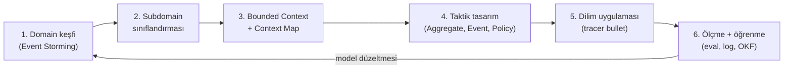
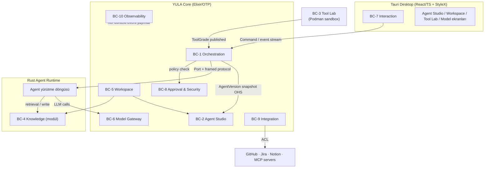

# YULA — Domain-Driven Design Proje Planı

**Stratejik + Taktik Tasarım · Coding-Agent Yürütme Planı**

| | |
|---|---|
| **Sürüm** | 1.0 |
| **Tarih** | 13 Temmuz 2026 |
| **Ürün sahibi** | Arif |
| **Kaynak belgeler** | `YULA_Proje_Analizi_2026-07-13.md` (fizibilite), OKF SPEC v0.1, CARB-46 epic (dogfooding iş yükü) |
| **Belge türü** | DDD stratejik + taktik tasarım ve uygulama planı — **kod içermez** |
| **Hedef okuyucu** | Arif + coding agentlar (Claude Code, Codex, PI vb.) |

---

## 0. Bu belge nasıl kullanılır

Bu belge YULA'nın **kanonik planlama belgesidir**. Coding agentlar her oturumda şu hiyerarşiye uyar:

1. **Bu plan** — stratejik/taktik tasarım, sınırlar, fazlar. Çelişki durumunda kazanan taraf (yeni bir ADR ile değiştirilene kadar).
2. **ADR'ler** (`docs/adr/`) — verilmiş mimari kararlar. Bir karar ancak yeni bir ADR ile değişir; sessizce delinmez.
3. **OKF knowledge bundle** (`knowledge/`) — yaşayan proje bilgisi: tasarım notları, spike sonuçları, oturum logları, öğrenilen dersler.
4. **Kod** — yukarıdakilerin türevi; kod hiçbir zaman tasarımın kaynağı değildir.

### Coding agent kuralları (MUST)

- Her oturum, ilgili bundle'ın `index.md` ve `log.md` dosyalarını okuyarak başlar (bkz. §8 Oturum Ritüeli).
- Her anlamlı iş sonunda `log.md`'ye tarihli girdi yazılır; mimari etki varsa ADR taslağı açılır.
- Ubiquitous Language terimleri (bkz. §3.2) kodda, testte, migration'da, UI kopyasında **İngilizce ve birebir** kullanılır. Eş anlamlı türetme yasaktır (`Task` varken `Job` icat edilmez).
- Bir bounded context başka bir context'in iç modeline doğrudan erişmez; yalnızca yayınlanmış sözleşmeler (event, port, API) üzerinden konuşur.
- Domain katmanına framework, IO, SDK sızmaz (Clean Architecture, bkz. §5).
- Bu belgede kod yoktur ve agentlar bu belgeye kod eklemez; kod repo'da, gerekçe ADR'de, bilgi OKF'te yaşar.

### Anahtar sözcükler

**MUST / MUST NOT** = zorunlu · **SHOULD** = güçlü öneri, sapma gerekçelendirilir · **MAY** = serbest.

---

## 1. Vizyon ve hedef çıktılar

### 1.1 Ürün tanımı

> **YULA, kişisel bilgisayarda çalışan; kullanıcının hedeflerini planlara dönüştüren, uzman agentları ve araçları yöneten, görevleri güvenli yürütme ortamlarında çalıştıran, sonuçları ölçen ve kullanıcının onay sınırları içinde kalıcı bilgi üreten yerel öncelikli bir AI orchestration platformudur.**

### 1.2 v1 sonunda kullanıcı deneyimi (kabul edilen hedef resim)

1. **Arka planda çalışan macOS masaüstü uygulaması** (menü çubuğu/tray ajanı; MacBook Air / Apple Silicon birincil hedef). İstenince aktifleşir; **push-to-talk** ile, sonraki fazda **handsfree (wake-word)** ile sesli konuşulur.
2. **Workspace'ler = personalar:** Home, Work, Learn, R&D, Mim-R (DJ & müzik prodüksiyon), Author, Journalist. Her workspace altında projeler, dosyalar, sürekli çalışılan konular; her workspace'in kendi OKF bilgi bundle'ı (Obsidian-uyumlu, bkz. §6).
3. **Agent Studio:** YULA dahil tüm agentlar kullanıcı tarafından tanımlanır; global ya da workspace/proje seviyesinde bağlanır.
4. **Yönetim arayüzü (Tauri + React/TypeScript + StyleX):** workspace/proje süreçlerini, dosyaları, çalışan görevleri, onayları tek yerden gösterir. *(Not: "facebook/astryx" ifadesi facebook/stylex olarak yorumlandı; farklıysa Faz 0'da ADR ile düzeltilir.)*
5. **Model yönetimi:** sağlayıcılar, model profilleri, agent başına model politikası, default system prompt'ların sürümlü modifikasyonu.
6. **MCP yönetimi:** MCP server kayıt/keşif/izin/sağlık ekranı; araçlar MCP-öncelikli bağlanır.
7. **Connector'lar:** GitHub, Jira, Notion — proje seviyesinde ilişkilendirilir.
8. **Second brain:** OKF (kanonik, git-sürümlü markdown) + SQLite FTS5 + **sqlite-vec** (türetilmiş arama indeksi). Bağlam hiç kopmaz; YULA her oturumda kaldığı yerden devam eder ve **kendi bilgi tabanını sürekli geliştirir** (bkz. §6.5 öz-gelişim döngüsü).

### 1.3 Çerçeve kararlar (fizibilite analizinden devralınan + bu planla netleşen)

| Karar | Değer | Not |
|---|---|---|
| Masaüstü kabuk | Tauri + React/TS + StyleX | Analiz §4.3 |
| Orchestration çekirdeği | Elixir/OTP (kontrol düzlemi) | Analiz §4.1 |
| Agent yürütme | Deklaratif agent tanımı + **tek ortak Rust runtime** | Analiz §5 |
| Elixir–Rust IPC | Port + uzunluk ön ekli çerçeveli protokol | Analiz §3.4 |
| Container runtime | **Podman (rootless, daemonless)** — Docker değil | Port arkasında değiştirilebilir; bkz. ADR-0007 (§11) |
| Kubernetes | v1'de yok | Geçiş ölçütleri analiz §4.5 |
| Vector arama | **sqlite-vec** (Apache-2.0/MIT) + FTS5 | `sqliteai/sqlite-vector` lisans riski nedeniyle elendi |
| Bilgi formatı | **OKF v0.1** bundle'ları (markdown + YAML frontmatter, git) | Kanonik kayıt; index türetilmiş |
| Model router | Kendi ModelGateway sözleşmesi; OmniRoute yalnız opsiyonel sidecar POC | Analiz §10 |
| Mobil | v1 sonrası; önce Telegram pilotu, sonra RN + E2EE relay | Analiz §11 |
| İlk kullanıcı | Arif (tek kullanıcı); SaaS/çok kullanıcı kapsam dışı | Analiz §2 |
| Ses | Push-to-talk (yerel STT) Faz 4; wake-word ayrı gizlilik projesi olarak Faz 5+ | Analiz §17 ile uyumlandı |
| Dogfooding | CARB-46 (Carbonorm Agentic Marketing epic) YULA ile birlikte yürütülür | Bkz. §9 |

---

## 2. DDD uygulama akışı — planın kendisi de DDD ile ilerler

Bu plan yalnızca DDD *çıktılarını* vermez; proje **DDD sürecinin kendisiyle** yürütülür ki Arif süreci kendi zihninde de kursun. Döngü:



**Adımların anlamı:**

1. **Domain keşfi (Event Storming):** İş akışı, domain event'leri (turuncu), komutlar (mavi), aktörler, policy'ler ve hotspot'lar üzerinden konuşulur. YULA'da her faz açılışında o fazın kapsamı için 1–2 saatlik (Arif + agent) storming oturumu yapılır; çıktı OKF'e `knowledge/design/event-storming/<faz>.md` olarak işlenir.
2. **Subdomain sınıflandırması:** Neyin *core* (rekabet farkı), neyin *supporting*, neyin *generic* (satın al/hazır kullan) olduğu netleşir → yatırım kararı buradan çıkar.
3. **Bounded Context + Context Map:** Dil sınırları çizilir; aynı kelimenin farklı anlam taşıdığı yerde sınır vardır. İlişki desenleri (Customer–Supplier, ACL, OHS…) bilinçli seçilir.
4. **Taktik tasarım:** Her context içinde aggregate'ler, invariant'lar, domain event'ler, policy'ler, port'lar tanımlanır. Kod bu tasarımın çevirisidir.
5. **Dilim uygulaması:** Her iş paketi uçtan uca ince bir dilimdir (tracer bullet — CARB epic'indeki sıralama disiplininin aynısı): domain → application → adapter → UI → test.
6. **Ölçme + öğrenme:** Eval sonuçları, execution trace'leri ve retrospektif notları OKF'e yazılır; model (tasarım) güncellenir. **Bu adım YULA'nın öz-gelişim döngüsünün de temelidir.**

Her fazın "Definition of Done" listesinde bu altı adımın izleri aranır (bkz. §7).

---

## 3. Stratejik tasarım

### 3.1 Domain ve subdomain sınıflandırması

**Ana domain:** Kişisel AI orkestrasyonu — *"kullanıcının niyetini, onun onay sınırları içinde, ölçülebilir ve güvenli işe dönüştürmek."*

| Subdomain | Tür | Gerekçe / strateji |
|---|---|---|
| Orchestration & Execution | **Core** | YULA'nın kalbi; Elixir/OTP ile kendimiz yazarız. |
| Agent Definition (Agent Studio) | **Core** | Sürümlü deklaratif agent modeli ürün farkıdır. |
| Tool Qualification (Tool Lab) | **Core** | Araçları test edip derecelendirme benzersiz değer; Podman sandbox burada. |
| Knowledge (Second Brain) | **Core** | OKF + sqlite-vec; süreklilik ("bağlam kopmaz") ve öz-gelişim burada yaşar. |
| Workspace & Persona | Supporting | Core'ları çerçeveler; karmaşık iş kuralı azdır ama her şeyin bağlamıdır. |
| Model Gateway | Supporting | Sözleşme bizim, sağlayıcılar değiştirilebilir; OmniRoute opsiyonel sidecar. |
| Approval & Security | Supporting (kritik) | Risk seviyeleri R0–R4, capability izinleri, audit. Basit ama taviz verilmez. |
| Interaction (chat + ses) | Supporting | PTT/handsfree, chat inbox; STT/TTS hazır motorlarla (whisper.cpp vb.). |
| Integration (MCP + connector'lar) | Supporting | MCP registry + GitHub/Jira/Notion adaptörleri; ACL ile izole edilir. |
| Observability & Cost | Supporting | Trace, bütçe, maliyet; OpenTelemetry-benzeri iç model, yerel dashboard. |
| Remote Access (mobil/relay) | Supporting (ertelenmiş) | v1 sonrası; Telegram pilotu → RN + E2EE relay. |
| Identity & Secrets | **Generic** | OS keychain, cihaz eşleme; hazır mekanizmalar kullanılır, icat edilmez. |

> **Yatırım kuralı:** Core subdomain'lerde en iyi tasarım + en yüksek test yoğunluğu. Supporting'de "yeterince iyi". Generic'te hazır çözüm; özelleştirme minimum.

### 3.2 Ubiquitous Language — sözlük

Terimler kodda İngilizce kullanılır; tanım cümlesi bağlayıcıdır. (Kısaltılmış çekirdek sözlük — tam sözlük `knowledge/design/glossary.md`'de yaşar ve Faz 0'da dondurulur.)

| Terim (EN) | Tanım |
|---|---|
| **Workspace** | Kullanıcının bir personasını temsil eden en üst çalışma bağlamı (Home, Work, Learn, R&D, Mim-R, Author, Journalist). Kendi bilgi bundle'ı, agent bağlamaları ve politikaları vardır. |
| **Project** | Workspace altında, connector'lara bağlanabilen, dosya ve görev taşıyan çalışma birimi. |
| **AgentDefinition / AgentVersion** | Bir uzman çalışanın sürümlü deklaratif tanımı: persona, talimat, model politikası, skill listesi, izinler, bellek erişimi, bütçe, eval kriterleri. Immutable version. |
| **AgentBinding** | Bir AgentVersion'ın global, workspace veya proje kapsamına bağlanması. |
| **Skill / SkillVersion** | Bir işin *nasıl* yapılacağını anlatan sürümlü yöntem paketi (manifest + talimat + test). |
| **Tool / ToolVersion** | Çalıştırılabilir yetenek: MCP server, CLI, HTTP servisi veya container imajı; lisans + güven skoru taşır. |
| **ToolGrade** | Tool Lab değerlendirmesinin sonucu: quarantined → evaluated → approved → deprecated. |
| **Workflow / WorkflowVersion** | Node/edge, retry, paralellik ve onay noktalarından oluşan sürümlü akış tanımı. |
| **Execution / StepExecution** | Bir workflow/agent çalıştırmasının runtime kaydı; bağlandığı tüm sürümler immutable'dır. |
| **ApprovalRequest** | R2+ riskli eylemin insan kararına sunulması: özet, risk seviyesi, diff, süre, karar. |
| **RiskLevel (R0–R4)** | Eylem risk sınıfı: R0 read-only … R4 finansal/yıkıcı (analiz §12.2). |
| **CapabilityGrant** | Bir agent/skill'e verilen daraltılmış izin: komut ailesi, klasör, domain, secret scope. |
| **ModelProvider / ModelProfile** | Sağlayıcı ucu ve tek modelin yetenek/maliyet/veri politikası profili. |
| **ModelPolicy** | Agent'ın model seçim stratejisi: quality-first, local-only, cheap, fast. |
| **PromptProfile / PromptVersion** | Default system prompt'ların sürümlü, aktivasyonu atomik yönetimi (draft → active → rollback). |
| **KnowledgeBundle** | Bir workspace'in OKF v0.1 uyumlu, git-sürümlü markdown bilgi deposu (kanonik kayıt). |
| **Concept** | OKF bundle içindeki tek bilgi belgesi (frontmatter `type` zorunlu; concept ID = dosya yolu). |
| **KnowledgeChunk** | Concept gövdesinden türetilen, embedding'i sqlite-vec'te tutulan arama birimi. Türetilmiştir; her an yeniden inşa edilebilir. |
| **Provenance** | Bilginin kaynağı: URL/dosya/execution + timestamp + confidence. Kaynaksız bilgi yazılamaz. |
| **SessionJournal** | Bir etkileşim oturumunun yapılandırılmış özeti; bağlam sürekliliğinin taşıyıcısı (§6.4). |
| **HandoffBrief** | Bir agent'tan diğerine (veya oturumdan oturuma) devredilen sıkıştırılmış bağlam paketi. |
| **EvaluationSuite / EvaluationRun** | Agent/skill/tool için test seti ve koşum sonucu; promotion kararlarının kanıtı. |
| **ToolLabSession** | Bir tool adayının Podman sandbox'ta izole test koşumu. |
| **AuditEvent** | Değiştirilemez eylem kaydı: kim, hangi agent, hangi model, hangi tool, hangi parametre. |
| **SecretReference** | Secret'ın kendisi değil; OS keychain referansı + scope. |
| **Device / Pairing** | Masaüstü/mobil cihaz kimliği, anahtarı ve revoke durumu (Remote Access fazında). |

> **Sınır işareti:** "Agent" kelimesi yalnızca AgentDefinition/AgentVersion bağlamında kullanılır; işletim sistemindeki süreçler "worker", Mastra/CARB tarafındaki agentlar "CARB agent" diye anılır. Aynı kelime iki context'te farklı anlama geliyorsa bu bir bounded-context sınırıdır ve sözlük hangi context'te hangi anlamın geçerli olduğunu söyler.

### 3.3 Bounded Context'ler

Her context için: amaç, sorumluluk, *sorumlu olmadığı* alan, çalıştığı süreç. Sınır tanımı bağlayıcıdır; bir yetenek iki context'e aynı anda ait olamaz.

#### BC-1 · Orchestration Context *(Core — Elixir/OTP)*

- **Amaç:** Kullanıcı niyetini plana, planı adım adım yürütülen, denetlenebilir Execution'lara dönüştürmek.
- **Sorumluluklar:** Workflow yorumlama; Execution/StepExecution yaşam döngüsü; paralel/sıralı çalıştırma; DynamicSupervisor ile Rust worker yönetimi (Port); timeout, cancellation, heartbeat, retry, checkpoint; event stream yayını; scheduling (cron benzeri tetikleyiciler).
- **Sorumlu olmadığı:** LLM çağrısının kendisi (BC-6), izin kararı (BC-8), bilgi saklama (BC-4), agent tanımının içeriği (BC-2).
- **Süreç:** YULA Core (Elixir release, Tauri sidecar).

#### BC-2 · Agent Studio Context *(Core — Elixir domain + Tauri UI)*

- **Amaç:** Agent, Skill ve Workflow tanımlarının sürümlü, deklaratif, test edilebilir yönetimi.
- **Sorumluluklar:** AgentDefinition/AgentVersion CRUD + immutable versiyonlama; AgentBinding (global/workspace/proje); SkillPackage yönetimi; WorkflowDefinition düzenleme; EvaluationSuite tanımı; başlangıç agent ekibi (Chief of Staff, Senior Software Engineer, Software Architect, Applied AI Engineer, Business Developer, Research Analyst, Knowledge Curator, Tool Evaluator).
- **Sorumlu olmadığı:** Çalıştırma (BC-1), izin uygulaması (BC-8; Agent Studio yalnızca *talep edilen* izinleri deklare eder).
- **Kural:** Bir Execution başladıktan sonra bağlı AgentVersion/SkillVersion/ToolVersion/WorkflowVersion değişmez.

#### BC-3 · Tool Lab Context *(Core — Elixir domain + Rust tool runner + Podman)*

- **Amaç:** Farklı dillerde yazılmış araçları keşfetmek, izole ortamda test etmek, derecelendirmek ve güvenli kullanım sözleşmesine bağlamak.
- **Sorumluluklar:** ToolPackage/ToolVersion kaydı (MCP/CLI/HTTP/container); lisans ve tedarik zinciri kontrolü; **Podman rootless sandbox**'ta ToolLabSession koşumu; EvaluationRun + hard gate; ToolGrade yaşam döngüsü (quarantined → evaluated → approved → deprecated); `claude-video` pilotu. Crawl4AI, yalnız değerlendirilmiş bir **Web Ingestion Skill** üzerinden; MarkItDown ise yalnız değerlendirilmiş bir **Document Ingestion Skill** üzerinden bağlanabilecek quarantined Tool Lab adaylarıdır. Bu araçlar global olarak bütün agentlara verilmez; sadece ihtiyacı olan AgentVersion'lara en dar capability kapsamıyla bağlanır.
- **Podman kararının sınıra etkisi:** Daemon yok, root yok, host'a socket mount problemi yok — analizdeki "Docker socket mount edilmez" riski kökten ortadan kalkar. Sandbox varsayılanları: non-root user, read-only rootfs, `--network=none` (gerekirse domain-allowlist proxy), CPU/RAM/PID/süre limitleri, iş sonunda container+volume+geçici secret imhası. macOS'ta `podman machine` üzerinden çalışır; runtime bir **ContainerRuntimePort** arkasındadır — Docker/başka runtime adaptörü eklenebilir ama varsayılan Podman'dır (ADR-0007).
- **Sorumlu olmadığı:** Onaylı tool'un üretimde çağrılması (BC-1 yürütür, BC-8 izinler).

#### BC-4 · Knowledge Context *(Core — Rust modül + Elixir API)*

- **Amaç:** Second brain: OKF bundle'larını kanonik kayıt, sqlite-vec+FTS5'i türetilmiş indeks olarak yöneterek kaynaklı, silinebilir, sürekli bağlam sağlamak.
- **Sorumluluklar:** Ingestion (belge, video transkripti, web, execution çıktısı → Concept); chunking + embedding; hibrit retrieval (FTS5 + vector + recency/provenance ağırlığı); SessionJournal ve HandoffBrief üretimi; Obsidian vault uyumu; retention ve gerçek silme; öz-gelişim döngüsü kayıtları (recipe/anti-pattern — bkz. §6.5). Bütün kalıcı OKF ve indeks yazıları Core içindeki tek **KnowledgeWriter** üzerinden serileştirilir; agentlar ve worker'lar ortak SQLite'a doğrudan yazamaz.
- **Sorumlu olmadığı:** Bilginin *hangi* agent'a görünür olduğu kararının uygulanması (politika BC-8'den gelir, BC-4 uygular); model çağrısı (embedding çağrıları BC-6 üzerinden).

#### BC-5 · Workspace Context *(Supporting — Elixir domain + Tauri UI)*

- **Amaç:** Persona-workspace'ler, projeler ve bunların agent/bilgi/connector bağlamlarını yönetmek.
- **Sorumluluklar:** Workspace CRUD (Home, Work, Learn, R&D, Mim-R, Author, Journalist + kullanıcı tanımlı); Project CRUD; AgentBinding scope çözümü ("bu projede hangi agentlar aktif?"); workspace→KnowledgeBundle eşlemesi; workspace bazlı varsayılan politikalar (model, bütçe, risk toleransı); ConnectorLink (proje ↔ GitHub repo / Jira proje / Notion sayfa).
- **Sorumlu olmadığı:** Connector API konuşması (BC-9), bilgi içeriği (BC-4).

#### BC-6 · Model Gateway Context *(Supporting — Elixir + sağlayıcı adaptörleri)*

- **Amaç:** Tüm LLM/embedding çağrılarını tek sözleşme arkasında normalize etmek; sağlayıcı bağımsızlığını korumak.
- **Sorumluluklar:** Provider adaptörleri (Anthropic, OpenAI, Gemini, OpenAI-compatible, Ollama/llama.cpp/LM Studio); ModelProfile kataloğu (context, fiyat, latency, veri politikası); ModelPolicy çözümü; streaming/tool-calling/structured-output/vision yetenek kaydı; bütçe/kota/retry/circuit-breaker/fallback; redaction'lı loglama; execution kaydına sağlayıcı+model sürümü yazma; **PromptProfile yönetimi** (default system prompt modifikasyonu, atomik aktivasyon, rollback); OmniRoute'un opsiyonel sidecar adaptör olarak takılıp sökülebilmesi.
- **Sorumlu olmadığı:** Hangi agent'ın hangi bütçeyi aşabileceği kararı (politika BC-8/BC-11 verisiyle).

#### BC-7 · Interaction Context *(Supporting — Tauri UI + Rust ses modülü)*

- **Amaç:** Kullanıcı ile tüm doğrudan temas: chat inbox, komutlar, bildirimler, ses.
- **Sorumluluklar:** Conversation/Message modeli; komut yönlendirme (niyet → BC-1'e Command); push-to-talk yakalama + yerel STT (whisper.cpp sınıfı) + TTS; tray/menü çubuğu durumu; bildirimler; onay kartlarının UI'da gösterimi (karar BC-8'de).
- **Faz notu:** Handsfree/wake-word ayrı bir gizlilik-performans dilimidir (Faz 5+); mimari mikrofon pipeline'ını baştan "kaynak → izinli dinleyici" soyutlamasıyla kurar.

#### BC-8 · Approval & Security Context *(Supporting-kritik — Elixir)*

- **Amaç:** Default-deny güvenlik: capability izinleri, risk sınıflandırması, insan onayı, audit.
- **Sorumluluklar:** CapabilityGrant modeli (komut ailesi, klasör, domain, secret scope); RiskLevel R0–R4 sınıflandırma policy'si; ApprovalRequest yaşam döngüsü; immutable AuditEvent zinciri; SecretReference (OS keychain); artifact karantinası; **emergency stop** (tüm worker/container'ları durduran kill switch); prompt-injection savunma politikası (retrieved içerik = güvenilmeyen veri; typed tool şeması dışında shell yok).
- **Sorumlu olmadığı:** UI gösterimi (BC-7), eylemin kendisi (BC-1/BC-3).

#### BC-9 · Integration Context *(Supporting/Generic — Elixir adaptörleri)*

- **Amaç:** Dış dünya bağlantıları: MCP registry + GitHub/Jira/Notion connector'ları.
- **Sorumluluklar:** McpServer kaydı (endpoint, yetenekler, izinler, sağlık); MCP tool keşfi → BC-3'e aday bildirimi; connector adaptörleri (issue/PR/sayfa okuma-yazma) — her biri **Anticorruption Layer** arkasında; ConnectorLink senkron durumu.
- **Sorumlu olmadığı:** Connector'dan gelen bilginin kalıcılaştırılması (BC-4 karar verir), yazma izni (BC-8; dış yazmalar R3'tür).

#### BC-10 · Observability & Cost Context *(Supporting — Elixir + SQLite/JSONL)*

- **Amaç:** Her Execution'ı tek trace olarak izlemek; bütçeleri yönetmek.
- **Sorumluluklar:** Trace/span modeli (planlama, model çağrıları, tokenlar, cache, tool exit code'ları, retry nedenleri, approval bekleme, artifact lineage); tahmini vs gerçek maliyet; günlük/aylık global + agent + workflow + execution bütçeleri; "önce ucuz/local, eval düşükse yükselt" politikasına veri sağlama; yerel dashboard.

#### BC-11 · Remote Access Context *(Ertelenmiş — Faz 6)*

- **Amaç:** Telefon üzerinden kumanda: görev verme, izleme, riskli onaylar.
- **Kapsam:** Önce Telegram pilotu (yalnız kumanda+bildirim, ikinci onay şart); sonra React Native + E2EE relay (outbound WSS, QR pairing, device revoke, biometrik onay). Relay yalnız taşıyıcıdır; state ve hafıza bulutta tutulmaz.

#### BC-12 · Identity & Secrets *(Generic)*

- OS keychain entegrasyonu, cihaz kimliği, yerel session token'ları (Tauri host ↔ Core). Hazır mekanizma; özelleştirme minimum.

### 3.4 Context Map



**İlişki desenleri (bağlayıcı):**

| İlişki | Desen | Anlamı |
|---|---|---|
| BC-2 → BC-1 | **Open Host Service / Published Language** | Agent Studio, yürütmeye immutable "AgentVersion snapshot" sözleşmesi yayınlar; Orchestration iç modele bakmaz. |
| BC-1 ↔ Rust runtime | **Published Language** (framed Port protokolü) | `start_execution, cancel, tool_request, tool_result, token_delta, checkpoint, completed, failed, heartbeat`; her mesajda `protocol_version, execution_id, correlation_id, deadline, trace_id`. |
| BC-1 → BC-8 | **Customer–Supplier** (BC-8 upstream) | Her R1+ adım politika kontrolünden geçer; BC-8 sözleşmeyi belirler. |
| BC-3 → BC-1/BC-2 | **Customer–Supplier** | Yalnız `approved` ToolGrade'li ToolVersion'lar yürütmede kullanılabilir. |
| BC-6 → sağlayıcılar | **Anticorruption Layer** | Her provider SDK'sı adaptörde izole; OmniRoute da yalnızca bir adaptördür. |
| BC-9 → GitHub/Jira/Notion/MCP | **Anticorruption Layer** | Dış modeller (Jira issue, Notion block) YULA diline çevrilir; iç modele sızmaz. |
| BC-4 ↔ Obsidian vault | **Conformist (dosya düzeyinde)** | OKF bundle Obsidian'ın açabileceği düz markdown kalır; Obsidian'a özel eklenti varsayılmaz. |
| BC-7 → BC-1 | **Customer–Supplier** | UI, Core'un versioned localhost API/WebSocket sözleşmesine uyar. |
| BC-11 → BC-1/BC-8 | **ACL + Published Language** | Mobil komutlar aynı Command/Approval sözleşmesinden geçer; ayrı arka kapı yoktur. |

---

## 4. Taktik tasarım — context bazında

Gösterim: **Aggregate (root)** · içerdiği entity/VO'lar · invariant'lar · yayınladığı domain event'ler. Repository'ler aggregate başına birdir; aggregate'ler arası referans yalnızca ID iledir. Domain event isimleri geçmiş zamandadır ve Published Language'in parçasıdır.

### 4.1 BC-1 Orchestration

| Aggregate | İçerik | Temel invariant'lar |
|---|---|---|
| **Execution** (root) | StepExecution (entity), ExecutionBudget (VO), Checkpoint (VO), VersionSnapshot (VO: bağlı Agent/Skill/Tool/Workflow/Prompt sürümleri) | Başladıktan sonra VersionSnapshot değişmez · bütçe aşımı → `suspended`, asla sessiz devam · her state geçişi adlandırılmış transition'dır (serbest update yok) · worker kaybında durum `unknown/failed`, idempotency politikasına göre yeniden başlatma |
| **WorkflowDefinition** (root) | WorkflowVersion (entity), Node/Edge (VO), RetryPolicy (VO), ApprovalPoint (VO) | Aktif Execution'ı olan version silinemez · yayınlanan version immutable |
| **Schedule** (root) | Trigger (VO: cron/interval/event) | Tetik, yeni Execution yaratır; çalışanı mutasyona uğratmaz |

**Domain event'ler:** `ExecutionStarted`, `StepCompleted`, `StepFailed`, `ExecutionSuspended(reason: approval|budget|generation|error)`, `ExecutionResumed`, `ExecutionCompleted`, `ExecutionCancelled`, `CheckpointRecorded`, `WorkerCrashed`.

**Policy örnekleri:** *"ExecutionSuspended(approval) → ApprovalRequest oluştur (BC-8)"* · *"WorkerCrashed → checkpoint'ten kurtar veya failed işaretle"* · *"StepFailed + RetryPolicy → backoff ile yeniden dene"*.

### 4.2 BC-2 Agent Studio

| Aggregate | İçerik | Temel invariant'lar |
|---|---|---|
| **AgentDefinition** (root) | AgentVersion (entity: persona, instructions, ModelPolicy VO, skill/tool referansları, MemoryScope VO, RequestedCapabilities VO, Budget VO, OutputSchema VO, EvalCriteria VO, ApprovalPreferences VO) | Version'lar immutable; değişiklik = yeni version · tam olarak bir `active` version (atomik geçiş, rollback mümkün) · RequestedCapabilities, bağlandığı scope'un politika tavanını aşamaz (kontrol BC-8'de) |
| **SkillPackage** (root) | SkillVersion (entity: manifest, talimat, testler, bağımlılıklar) | Version immutable · testleri olmayan skill `active` olamaz |
| **AgentBinding** (root) | Scope (VO: global/workspace/project), öncelik | Aynı scope'ta aynı AgentDefinition için tek aktif binding |
| **EvaluationSuite** (root) | TestCase (entity), Rubric (VO), Baseline (VO) | Baseline'sız regresyon karşılaştırması yapılamaz |

**Event'ler:** `AgentVersionPublished`, `AgentVersionActivated`, `AgentBound`, `AgentUnbound`, `SkillVersionPublished`, `EvaluationRunCompleted(score, regression?)`.

### 4.3 BC-3 Tool Lab

| Aggregate | İçerik | Temel invariant'lar |
|---|---|---|
| **ToolPackage** (root) | ToolVersion (entity: kind = mcp/cli/http/container, manifest, License VO, TrustScore VO, DeclaredCapabilities VO) | `approved` grade'e lisans kontrolü + en az bir başarılı EvaluationRun olmadan geçilemez · grade geçişleri tek yönlü sıralıdır (quarantined → evaluated → approved; her an → deprecated) · deprecated version yeni Execution'a bağlanamaz |
| **ToolLabSession** (root) | SandboxSpec (VO: Podman imajı, kaynak limitleri, network=none, ro-rootfs), SessionResult (VO: exit, metrikler, artifact'ler) | Sandbox dışına yalnız bildirilen artifact'ler çıkar · session sonunda container/volume/geçici secret imha edilir · host dosya sistemine doğrudan erişim yok |

**Event'ler:** `ToolCandidateRegistered`, `ToolLabSessionCompleted`, `ToolGraded`, `ToolDeprecated`.

**Policy:** *"MCP keşfi yeni tool bildirdi (BC-9) → quarantined ToolPackage oluştur"* · *"EvaluationRun hard-gate'i geçemedi → grade evaluated'da kalır, rapor OKF'e yazılır"*.

### 4.4 BC-4 Knowledge

| Aggregate | İçerik | Temel invariant'lar |
|---|---|---|
| **KnowledgeBundle** (root) | Concept (entity: path=ID, Frontmatter VO `type` zorunlu, gövde), IndexFile/LogFile (reserved) | OKF v0.1 konformansı (her concept parse edilebilir frontmatter + `type`) · kanonik kayıt yalnızca bundle'dır; git commit'i olmayan değişiklik "kaydedilmiş" sayılmaz |
| **KnowledgeSource** (root) | Provenance (VO: origin, timestamp, confidence, license), IngestionState (VO) | Provenance'sız Concept yazılamaz · silme gerçek silmedir: concept + chunk'lar + embedding'ler birlikte gider (log.md'ye silme kaydı düşülür) |
| **IndexShard** (root — türetilmiş) | KnowledgeChunk (entity: concept ID + aralık + embedding ref), FTS satırları | İndeks her an bundle'dan yeniden inşa edilebilir (rebuild deterministik) · chunk, kaynak concept silinince yaşayamaz |
| **SessionJournal** (root) | JournalEntry (VO), HandoffBrief (VO) | Her oturum kapanışında journal yazılır; bir sonraki oturum en son journal + ilgili index.md ile açılır |

**Event'ler:** `ConceptIngested`, `ConceptSuperseded`, `ConceptDeleted`, `IndexRebuilt`, `SessionJournalWritten`, `RecipePromoted`, `AntiPatternRecorded`.

**Retrieval politikası (varsayılan):** hibrit skor = FTS5 (BM25) + vector benzerlik (sqlite-vec) + recency + provenance güveni; sonuçlar daima kaynak atıflı döner. Agent'ın MemoryScope'u dışındaki koleksiyonlar sorguya hiç girmez.

### 4.5 BC-5 Workspace

| Aggregate | İçerik | Temel invariant'lar |
|---|---|---|
| **Workspace** (root) | Persona profili (VO), DefaultPolicies (VO: model, bütçe, risk toleransı), BundleRef (VO) | Her workspace'in tam bir KnowledgeBundle'ı vardır · workspace silinmeden bundle silinemez |
| **Project** (root) | ConnectorLink (entity: kind=github/jira/notion, dış ID, sync durumu), dosya referansları | ConnectorLink'in dış kimliği ACL çevirisinden geçmiş olmalı · proje arşivlenince bağlı otomasyonlar durur |

**Event'ler:** `WorkspaceCreated`, `ProjectCreated`, `ConnectorLinked`, `ConnectorUnlinked`, `ProjectArchived`.

### 4.6 BC-6 Model Gateway

| Aggregate | İçerik | Temel invariant'lar |
|---|---|---|
| **ModelProvider** (root) | ModelProfile (entity: capability'ler, fiyat, context, DataPolicy VO), HealthState (VO) | Anahtarlar SecretReference'tır; profil içinde plaintext secret olamaz |
| **PromptProfile** (root) | PromptVersion (entity), ActivationState (VO) | Tam bir `active` version; aktivasyon/rollback atomik · her Execution kullandığı PromptVersion'ı VersionSnapshot'a yazar |
| **RoutingPolicy** (root) | Rule (VO: ModelPolicy → aday modeller), Fallback zinciri (VO) | Fallback zinciri döngüsüz · "local-only" politikasında bulut adayı üretilemez |

**Event'ler:** `ModelCallCompleted(tokens, cost, latency)`, `ModelCallFailed(reason)`, `FallbackTriggered`, `PromptVersionActivated`, `BudgetThresholdReached`.

### 4.7 BC-8 Approval & Security

| Aggregate | İçerik | Temel invariant'lar |
|---|---|---|
| **CapabilityGrant** (root) | Scope (VO: command family / path / domain / secret), TTL (VO) | Default deny; grant yoksa erişim yoktur · grant, execution süresinden uzun yaşayamaz (kalıcı grant ayrı ve açık karardır) |
| **ApprovalRequest** (root) | ActionSummary (VO), RiskLevel (VO), Diff (VO), Decision (VO) | R3+ eylem onaysız yürütülemez · karar immutable; süre aşımı = red · onay tek kullanımlıktır (replay edilemez) |
| **AuditTrail** (root, append-only) | AuditEvent (VO) | Yalnız ekleme; güncelleme/silme yok |

**Event'ler:** `ApprovalRequested`, `ApprovalGranted`, `ApprovalDenied`, `ApprovalExpired`, `EmergencyStopTriggered`, `CapabilityGranted`, `CapabilityRevoked`.

**Değişmez kurallar:** retrieved içerik (web, transcript, README, tool çıktısı) *veri*dir, talimat değildir; system policy'yi değiştiremez, secret isteyemez, tool çağrısı emredemez · agent çıktısı typed tool şeması dışında shell'e gidemez · indirilen dosya/üretilen executable önce karantina alanına düşer.

### 4.8 BC-7 / BC-9 / BC-10 (özet)

- **BC-7 Interaction:** `Conversation` (root; Message entity, VoiceCapture VO). Invariant: chat üzerinden onay kararı verilemez — onay tek yüzeyden (Approval UI) akar (CARB-59'daki dersin genelleştirilmişi). Event: `UserCommandIssued`, `VoiceTranscribed`.
- **BC-9 Integration:** `McpServer` (root; DiscoveredTool entity, Health VO) ve `ConnectorAccount` (root; scope'lu SecretReference). Invariant: dış yazma = R3; keşfedilen tool otomatik `approved` olamaz (Tool Lab'e gider). Event: `McpToolDiscovered`, `ExternalWriteRequested`, `SyncCompleted`.
- **BC-10 Observability:** `Trace` (root; Span entity, CostRecord VO) ve `BudgetLedger` (root). Invariant: her Execution tam bir Trace'e sahiptir; maliyet kaydı olmayan model çağrısı tamamlanmış sayılmaz. Event: `TraceClosed`, `BudgetExceeded`.

---

## 5. Mimari eşleme — Clean Architecture + SOLID

### 5.1 Süreç topolojisi

| Süreç | İçerdiği context'ler | Sınır gerekçesi |
|---|---|---|
| **Tauri Host (Rust, ince)** | BC-12'nin OS yüzü; pencere/tray/keychain/updater/sidecar lifecycle | UI–OS güvenlik sınırı; orchestration mantığı taşımaz (MUST NOT) |
| **UI (React/TS + StyleX, Tauri webview)** | BC-7 sunumu + tüm yönetim ekranları | Yalnız versioned localhost API/WebSocket konuşur; capability'ler default-deny |
| **YULA Core (Elixir release, sidecar)** | BC-1, BC-2, BC-5, BC-6, BC-8, BC-9, BC-10 (+BC-3 domain'i) | Kontrol düzlemi; supervision, event stream, state |
| **Rust Agent Worker (Port ile N adet)** | Agent yürütme döngüsü + BC-4 modülü (ingestion/embedding/retrieval) | Çökme izolasyonu; NIF değil ayrı süreç (MUST) |
| **Podman container'ları (ephemeral)** | BC-3 sandbox koşumları + container-tipi tool'lar | Güvenilmeyen kod çekirdekten tamamen ayrı |

### 5.2 Katmanlar (her context için aynı şablon)

1. **Domain:** aggregate'ler, VO'lar, domain event'ler, policy'ler — framework'süz, IO'suz, saf.
2. **Application:** use-case'ler (Command/Query handler'ları), transaction sınırı = tek aggregate; process manager/saga'lar (ör. "Execution onay bekliyor → onay geldi → devam") burada.
3. **Ports:** domain'in ihtiyaç sözleşmeleri. Driving: `CommandPort`, `QueryPort`. Driven: `ModelGatewayPort`, `ContainerRuntimePort` (Podman adaptörü varsayılan), `VectorIndexPort` (sqlite-vec adaptörü), `FullTextIndexPort` (FTS5), `BundleStorePort` (git+dosya), `SecretStorePort` (macOS keychain), `ConnectorPort` (github/jira/notion), `SpeechPort` (STT/TTS), `NotificationPort`, `ClockPort`.
4. **Adapters/Infrastructure:** SDK'lar, DB, dosya sistemi, IPC — hepsi dışta; domain'e sadece port arayüzünden dokunur.

### 5.3 SOLID eşlemesi (denetim listesi)

- **S:** Her aggregate tek değişim nedeni taşır (Execution durum makinesidir, maliyet hesabı BC-10'dadır).
- **O:** Yeni sağlayıcı/connector/runtime = yeni adaptör; mevcut domain koduna dokunulmaz (Podman→Docker geçişi tek adaptör dosyası olmalı).
- **L:** Tüm `ModelGatewayPort` adaptörleri aynı sözleşme testinden (contract test) geçer; OmniRoute adaptörü de aynı teste tabidir.
- **I:** Port'lar dar tutulur; UI'nin okuma modeli (Query) ile komut modeli (Command) ayrıdır (hafif CQRS).
- **D:** Bağımlılık daima içeri akar: adapter → application → domain. Domain hiçbir paketi import etmez.

### 5.4 Olay omurgası

Context'ler arası iletişim domain event'lerle (in-process pub/sub; Elixir içinde) yapılır; event şemaları Published Language'dir ve `knowledge/design/events.md`'de sürümlenir. UI, event stream'i WebSocket'ten tüketir. Event'ler aynı zamanda AuditEvent ve Trace kaynağıdır — tek gerçek, üç görünüm.

---

## 6. Knowledge sistemi derin tasarımı — OKF + sqlite-vec, "bağlam hiç kopmaz"

### 6.1 İki katmanlı gerçek modeli

| Katman | Teknoloji | Rol | Kural |
|---|---|---|---|
| **Kanonik kayıt** | OKF v0.1 bundle'ları: markdown + YAML frontmatter, git deposu | Bilginin tek gerçeği; insan + agent tarafından okunur/yazılır; diff'lenebilir, taşınabilir | Git commit'i olmayan bilgi yok hükmündedir |
| **Türetilmiş indeks** | SQLite: FTS5 + **sqlite-vec** (embedding'ler) | Hızlı hibrit arama; her an bundle'dan deterministik yeniden inşa | İndeks asla tek başına gerçek değildir; bozulursa silinip yeniden kurulur |

Bu ayrım "context'im hiç kopmayacak" garantisinin temelidir: indeks çökse, embedding modeli değişse, hatta SQLite dosyası silinse bile bilgi (git'teki bundle) kayıpsız durur ve indeks yeniden üretilir.

OKF Markdown, provenance ve git geçmişiyle **kalıcı kanonik hafızadır**. Embedding modeli Concept ve KnowledgeChunk'ların semantik temsillerini üretir; **sqlite-vec bir yapay sinir ağı veya kanonik hafıza değildir**, yalnızca türetilmiş vektörleri saklar ve benzerlik sorgularını çalıştırır.

### 6.1.1 Yazma sahipliği ve geçici bellek

- Kalıcı OKF, FTS5 ve sqlite-vec yazıları Core'daki tek `KnowledgeWriter` tarafından yapılır. Agentlar, Rust worker'lar ve ingestion tool'ları yazma niyetini typed API/event üzerinden iletir; ortak SQLite dosyasını doğrudan açmaz.
- SQLite WAL eşzamanlı okumaları destekler, ancak tek-yazar özelliğini kaldırmaz. Podman/container izolasyonu da aynı dosyaya çoklu yazarı güvenli hale getirmez; yazılar `KnowledgeWriter` kuyruğunda serileştirilir.
- Her Execution sandbox içinde geçici scratch memory kullanabilir. Knowledge Curator iş sonunda bu belleği siler veya provenance taşıyan seçilmiş bilgiyi OKF'e promote eder.
- Kalıcı agent başına “micro-brain” v1 kapsamı dışındadır; bilgi parçalanması ve tutarsızlık riski taşır. Workspace sharding ancak ölçülmüş yazma contention'ı bunu gerektirirse yeni ADR ile değerlendirilir.

### 6.2 Bundle yerleşimi

- Her **Workspace** = bir OKF bundle (ayrı git repo veya tek "brain" reposunda alt dizin): `brain/home/`, `brain/work/`, `brain/learn/`, `brain/rnd/`, `brain/mim-r/`, `brain/author/`, `brain/journalist/` + `brain/yula/` (YULA'nın kendi proje bilgisi — self-hosting).
- Her bundle OKF konvansiyonlarına uyar: dizin başına opsiyonel `index.md` (progressive disclosure), `log.md` (kronolojik güncelleme tarihi), diğer tüm `.md`'ler concept'tir; frontmatter'da `type` zorunlu, `title/description/tags/timestamp/resource` önerilir.
- **Obsidian uyumu:** Bundle'lar düz markdown olduğu için her bundle aynı zamanda bir Obsidian vault olarak açılabilir (Conformist ilişki, §3.4). YULA, Obsidian'a özel sözdizimine (dataview vb.) *bağımlı olamaz*; wikilink'ler standart markdown linke normalize edilir. Böylece Arif isterse aynı bilgiyi Obsidian'da gezer/düzenler; YULA dosya izleyicisiyle değişikliği alır, yeniden indeksler.
- Proje bilgisi, workspace bundle'ı içinde alt dizindir: `brain/work/projects/carbonorm/…`.

### 6.3 Ingestion hattı (BC-4)

1. **Kaynak alımı:** dosya, web sayfası, video (claude-video hattı: transcript-first → hedefli kareler), execution çıktısı, connector içeriği (Jira/Notion/GitHub — ACL'den geçmiş), sohbet özeti.
2. **Provenance zorunluluğu:** origin + timestamp + confidence (+ lisans) olmadan Concept yazılmaz; alıntılar timestamp'li atıf taşır.
3. **Concept üretimi:** Knowledge Curator agent'ı içeriği OKF concept'ine dönüştürür (frontmatter + yapılandırılmış gövde; OKF'in konvansiyonel `# Schema`/`# Examples`/`# Citations` başlıkları kullanılır), ilgili `index.md` ve `log.md` güncellenir, git commit atılır.
4. **İndeksleme:** chunking (başlık-sınırlı, overlap'li) → embedding (BC-6 üzerinden; local-first embedding modeli tercih) → sqlite-vec'e vektör, FTS5'e metin. Commit hash'i chunk'a işlenir; eski commit'in chunk'ları süpürülür.
5. **Güvenlik:** ingest edilen her içerik "güvenilmeyen veri" etiketiyle dolaşır; retrieval sonuçları prompt'a *veri bloğu* olarak girer, talimat olarak değil.

### 6.4 Bağlam sürekliliği ("context hiç kopmaz") mekanikleri

1. **SessionJournal:** her oturum kapanışında yapılandırılmış özet: ne yapıldı, açık döngüler, kararlar, sıradaki adımlar → `log.md` girdisi + journal concept'i.
2. **HandoffBrief:** agent→agent veya oturum→oturum devirlerinde sıkıştırılmış bağlam paketi (hedef, kısıtlar, ilgili concept ID'leri, son durum). Yeni oturum açılışında: ilgili bundle `index.md` → son `log.md` girdileri → HandoffBrief → hedefe özel retrieval. Böylece hiçbir oturum sıfırdan başlamaz.
3. **VersionSnapshot + Trace bağlantısı:** "dün çalışan agent bugün neden farklı?" sorusu, execution kaydındaki sürümler + journal üzerinden her zaman yanıtlanabilir.
4. **Çalışma belleği ≠ bilgi:** kısa vadeli sohbet state'i (thread) SQLite'ta yaşar; kalıcı olması gereken her şey açık bir "promote to knowledge" adımıyla OKF'e iner (otomatik ama denetlenebilir; silinebilir).

### 6.5 Öz-gelişim döngüsü (YULA kendini geliştirir)

CARB'daki W9 deseninin (content_archive / prompt_antipatterns / prompt_recipes) genelleştirilmişi — YULA'nın **kendi** öğrenme hattı:

1. Her Execution kapanışında Trace + eval sonucu değerlendirilir.
2. **Onaylanan/başarılı** işlerden **Recipe** damıtılır: hangi agent + model + prompt deseni + tool zinciri işe yaradı → `brain/yula/recipes/…` concept'i (`RecipePromoted`). Dedupe: yakın-duplicate recipe süpersede edilir, eklenmez.
3. **Reddedilen/başarısız** işlerden **AntiPattern** kaydı → `brain/yula/anti-patterns/…` (`AntiPatternRecorded`).
4. Agent'lar planlama sırasında kendi scope'larındaki recipe/anti-pattern'leri retrieval ile çeker; yani sistem her onay/red kararından sonra bir sonraki işte daha iyidir.
5. **Capability sınırı (ADR-0007 CARB dersi):** betimleyici bilgi (recipe, anti-pattern, gözlem) otonom yazılabilir; **agent tanımı/prompt değişikliği asla otonom aktive edilmez** — YULA kendi promptunu ancak *draft* AgentVersion/PromptVersion olarak önerir, Arif onaylar (R3).
6. sqlite-vec burada kritiktir: recipe/anti-pattern araması semantiktir ("buna benzer bir işte ne işe yaramıştı?"), anahtar kelime araması yetmez.

---

## 7. Yol haritası — DDD akışıyla fazlar

Her faz mini-DDD döngüsüdür (§2): storming → tasarım güncellemesi → tracer-bullet dilimler → eval + OKF kaydı. Süre tahminleri tek kıdemli geliştirici + coding agent'lar içindir; analizdeki gerçekçilik notu geçerlidir (güvenilir kişisel v1 ≈ 6–9 ay).

### Faz 0 — Stratejik tasarım onayı + mimari spike (2–3 hafta)

**DDD adımı:** Domain keşfi + context map doğrulama.

| İş paketi | İçerik | Kabul kriteri |
|---|---|---|
| WP-0.1 Event Storming | Tüm ana akışlar (görev verme→onay→sonuç; tool onboarding; bilgi ingest) storming'le çıkarılır | `knowledge/design/event-storming/faz0.md` + hotspot listesi |
| WP-0.2 Sözlük dondurma | §3.2 sözlüğü tamamlanır ve dondurulur | `glossary.md` v1; agentlar için lint referansı |
| WP-0.3 Seed ADR'ler | §11 listesi yazılır | ADR-0001…0012 merge |
| WP-0.4 Monorepo iskeleti | §8.1 yapısı + CI (macOS arm64 birincil; Win/Linux build smoke) | Boş uçtan uca build yeşil |
| WP-0.5 Teknik spike'lar | Tauri→Elixir sidecar başlatma; Port üstünden 2 Rust worker paralel + token streaming + cancellation; SQLite event kaydı; **Podman machine üzerinde ephemeral sandbox koşumu (macOS)**; sqlite-vec + FTS5 hibrit sorgu POC; basit provider adaptörü + bir local model çağrısı | Worker crash'i Core/UI'yi düşürmüyor; execution state kurtarılıyor; sandbox non-root + network=none doğrulanmış |

**Çıkış ölçütü:** Analiz Faz 0 ölçütleri + context map'in spike'larla çelişmediğinin teyidi.

### Faz 1 — Orchestration + Agent Studio çekirdeği: Desktop Alpha (6–8 hafta)

**Context'ler:** BC-1, BC-2, BC-8 (çekirdek), BC-6 (asgari), BC-7 (chat), BC-10 (asgari), BC-5 (asgari workspace).

Tracer-bullet dilim sırası (her dilim uçtan uca: domain → application → adapter → UI → test):

1. Workspace iskeleti + chat/command inbox (tek workspace ile başla).
2. AgentDefinition/AgentVersion CRUD + immutable versiyonlama + aktivasyon.
3. Execution yaşam döngüsü: tek agent, tek adım; timeline UI + log + maliyet alanları.
4. ApprovalRequest + RiskLevel R0–R3 + emergency stop (tray'de).
5. Model Gateway asgari: Anthropic + OpenAI + bir local adaptör (Ollama); ModelPolicy çözümü; PromptProfile v1.
6. Paralel/sıralı çok-agent orchestration + VersionSnapshot + Trace.
7. Başlangıç agent ekibi (3–4 agent: Chief of Staff, Senior Software Engineer, Research Analyst, Knowledge Curator) + her birine EvaluationSuite.

**Çıkış ölçütü:** Arif günlük gerçek bir işi (ör. araştırma + özet) YULA'da uçtan uca, onay akışıyla koşturuyor; tüm state yeniden başlatmada kurtuluyor.

### Faz 2 — Tool Lab (Podman) + MCP + Model Gateway olgunlaşması (6–8 hafta)

**Context'ler:** BC-3, BC-9 (MCP), BC-6 (fallback/bütçe), BC-2 (skill).

1. ToolPackage/ToolVersion kayıt + lisans alanları; SkillPackage import + YULA manifesti.
2. MCP registry: server ekleme, keşif, sağlık; keşfedilen tool → quarantined aday.
3. **Podman sandbox hattı:** ContainerRuntimePort + Podman adaptörü; SandboxSpec varsayılanları; ToolLabSession koşumu + rapor.
4. EvaluationSuite → hard gate → ToolGrade promotion; contract test disiplini.
5. CLI/HTTP tool adaptörleri; typed tool call şeması (shell'e serbest metin yasak).
6. `claude-video` pilotu: Tool Lab'den geçir, Research Analyst'e bağla (transcript-first politikasıyla).
7. Bütçe/kota/fallback/circuit-breaker; (opsiyonel) OmniRoute sidecar POC — yalnız resmî API anahtarlı 3–4 sağlayıcı.

**Çıkış ölçütü:** Yeni bir aracın "keşif → karantina → test → onay → agent kullanımı" tam döngüsü, tamamı audit'li, koşuyor.

### Faz 3 — Second Brain: OKF + sqlite-vec tam entegrasyon (6–10 hafta)

**Context'ler:** BC-4 (tam), BC-5 (tam: 7 workspace), BC-9 (connector okuma).

1. 7 workspace bundle'ının açılışı + Obsidian-uyum doğrulaması.
2. Ingestion hattı: dosya + web + sohbet özeti; provenance zorunluluğu; Knowledge Curator devrede.
3. Hibrit retrieval + kaynak atıflı cevaplar; MemoryScope uygulaması.
4. SessionJournal + HandoffBrief; "kaldığın yerden devam" deneyiminin uçtan uca testi.
5. Video ingestion (claude-video → Concept, timestamp atıflı).
6. Öz-gelişim döngüsü v1: recipe/anti-pattern damıtma + retrieval'a bağlama (§6.5).
7. Memory CRUD, export, **gerçek silme**; koleksiyon bazlı gizlilik.
8. GitHub/Jira/Notion **okuma** connector'ları (ACL'li) + proje ilişkilendirme.

**Çıkış ölçütü:** YULA bir hafta boyunca günlük kullanımda dünkü bağlamı kaybetmeden çalışıyor; her cevap kaynak gösterebiliyor; recipe sayısı onaylarla artıyor.

### Faz 4 — Ses + connector yazma + günlük yaşam entegrasyonu (4–6 hafta)

**Context'ler:** BC-7 (ses), BC-9 (yazma), BC-5.

1. Push-to-talk: global kısayol → yerel STT (whisper.cpp sınıfı) → komut; TTS yanıt.
2. Menü çubuğu deneyimi: durum, hızlı komut, onay bildirimleri.
3. Connector **yazma** işlemleri (Jira issue güncelleme, Notion sayfa, GitHub yorum) — hepsi R3 onaylı.
4. Workspace bazlı sesli bağlam ("Mim-R'a geç" → persona + bundle + agent seti değişir).

**Çıkış ölçütü:** Arif gün içinde klavyesiz temel akışları (görev ver, durum sor, onayla) sesle yürütüyor.

### Faz 5 — Hardening + beta (8–12 hafta)

Signing/notarization (macOS öncelik), updater + çalışan execution'ların güvenli checkpoint'i, supply-chain kontrolleri, backup/restore/migration (bundle'lar git'te — indeks yeniden inşa provası), soak testleri, capability detection ("Podman yok" = hata değil özellik durumu), **handsfree/wake-word gizlilik tasarımı** (ayrı dilim: yerel wake-word, mikrofon göstergesi, fiziksel kapatma).

### Faz 6 — Remote Access (v1 sonrası, 4–8 hafta)

Telegram pilotu (kumanda+bildirim, ikinci onay) → React Native istemci + E2EE relay (outbound WSS, QR pairing, revoke, biometrik onay).

---

## 8. Coding-agent yürütme protokolü

### 8.1 Monorepo yerleşimi

```
yula/
├── docs/
│   ├── adr/                  # ADR-XXXX-basligi.md (immutable; superseded işaretlenir)
│   └── plan/                 # bu belge + faz planları
├── knowledge/                # YULA proje bundle'ı (OKF v0.1) — tasarım notları, spike sonuçları,
│   ├── index.md              # event-storming çıktıları, glossary, events.md, oturum logları
│   └── log.md
├── apps/
│   ├── desktop/              # Tauri host (Rust, ince) + UI (React/TS + StyleX)
│   ├── core/                 # Elixir umbrella: her bounded context ayrı OTP app
│   └── worker/               # Rust agent runtime + knowledge modülü
├── packages/
│   ├── contracts/            # Published Language: event şemaları, Port protokolü, API sözleşmeleri
│   └── eval/                 # EvaluationSuite tanımları ve koşucu
└── tools/                    # geliştirme yardımcıları, sandbox imaj tanımları (Podman)
```

Elixir umbrella içinde her context ayrı uygulamadır (`orchestration/`, `agent_studio/`, `tool_lab/`, `knowledge_api/`, `workspace/`, `model_gateway/`, `approval/`, `integration/`, `observability/`); context'ler arası çağrı yalnız public API modülü + event üzerinden yapılır (derleme-zamanı sınır denetimi eklenir).

### 8.2 Oturum ritüeli (her coding-agent oturumu, MUST)

1. `knowledge/index.md` → ilgili alanın `log.md` son girdileri → varsa HandoffBrief oku.
2. Üzerinde çalışılan iş paketinin faz tanımını (§7) ve ilgili context'in taktik tasarımını (§4) oku.
3. Plan yap; tasarımdan sapma gerekiyorsa **önce ADR taslağı**, sonra kod.
4. Tracer-bullet dilimi tamamla: domain → application → adapter → UI → test; tek dilim, tek PR.
5. Kapanış: `log.md`'ye tarihli girdi (ne yapıldı, açık döngüler, sıradaki adım) + gerekiyorsa HandoffBrief.

### 8.3 Definition of Done (her iş paketi)

- [ ] Ubiquitous Language'e uygun adlandırma; sözlük dışı yeni terim → sözlük güncellemesi PR'da.
- [ ] Domain katmanında framework/IO importu yok (lint ile denetlenir).
- [ ] Aggregate invariant'ları birim testli; adlandırılmış state geçişleri dışında mutasyon yok.
- [ ] Port'lar contract-test'li; **test suite'i hiçbir gerçek sağlayıcıyı çağırmaz** (FakeModelProvider, FakeContainerRuntime, FakeConnector — `test = 0 maliyet`, CARB kredi disiplininin aynısı). Gerçek sağlayıcı smoke'ları manuel + Arif onaylı.
- [ ] R2+ etkili her yeni yetenek Approval akışına bağlı; audit event üretiyor.
- [ ] `log.md` girdisi + (mimari etki varsa) ADR.
- [ ] Eval: davranış değiştiren PR'larda ilgili EvaluationSuite koşuldu, regresyon yok.

### 8.4 Guardrail'ler (MUST NOT)

- Gerçek API anahtarı/secret'ı koda, teste, log'a, UI'ya yazmak.
- Onay yüzeyini (Approval UI) atlayan alternatif karar yolu açmak (chat dahil).
- Bir context'in iç şemasına başka context'ten doğrudan sorgu atmak.
- Bu plan/ADR'lerle çelişen implementasyonu "geçici" diye merge etmek.
- Production'a (veya Arif'in makinesine sistem-geneli etkiyle) onaysız yazan otomasyon.

---

## 9. CARB-46 dogfooding planı — YULA ile birlikte yürütme

CARB-46 (Carbonorm Agentic AI Marketing, Mastra/Next.js) YULA'nın **ilk gerçek iş yüküdür**: YULA geliştirilirken Work workspace'i altında bu epic yürütülür. İki proje birbirini besler.

### 9.1 Yerleşim

- `Work` workspace → `projects/carbonorm/` projesi; ConnectorLink'ler: Jira (CARB), GitHub (repo), gerekirse Notion.
- CARB'ın OKF dokümanları (`/docs/marketing/…`, ADR 0004–0009) zaten OKF-uyumlu → doğrudan ingest edilir; YULA retrieval'ı CARB oturumlarında bağlam sağlar.

### 9.2 Faz eşlemesi

| YULA fazı | CARB'da YULA'nın rolü |
|---|---|
| Faz 0–1 | CARB işleri (CARB-60…63: Drive provisioning, staging prep, QA, prod push) Claude Code ile manuel yürür; YULA henüz izleyicidir — ama her oturum sonucu `projects/carbonorm/log.md`'ye işlenir (bağlam sürekliliği provası). |
| Faz 2 | Jira MCP/connector'ı Tool Lab'den geçirilir; YULA "CARB-62 QA checklist'inde ne kaldı?" tip sorulara kaynak atıflı cevap verir. |
| Faz 3 | CARB retrospektifleri, staging QA bulguları, cold-start dersleri (CARB-65/66/67) recipe/anti-pattern olarak damıtılır; YULA'nın öz-gelişim döngüsünün ilk gerçek verisi CARB'dan gelir. |
| Faz 4 | R3 onaylı connector yazmaları: YULA, Jira issue durumu güncelleme / yorum ekleme önerir, Arif onaylar. |

### 9.3 Dogfooding kuralları

- CARB tarafındaki kredi disiplini aynen korunur (FakeProvider, LOW bütçe, tek batched prod push, Arif'in açık go'su) — YULA bu kuralları *policy verisi* olarak tanır ve ihlal önerisini kendisi işaretler.
- CARB, YULA'nın domain modelini test eden dış örnektir: CARB'ın Review Queue'su ≈ YULA ApprovalRequest; CARB W9 ≈ YULA öz-gelişim döngüsü; CARB prompt versioning ≈ YULA PromptProfile. Desen farklılıkları görüldüğünde YULA tasarımı gözden geçirilir (öğrenme çift yönlü).

---

## 10. Riskler ve kapsam dışı

### 10.1 Ana riskler (izlenecek)

| Risk | Etki | Önlem |
|---|---|---|
| Kapsam patlaması (analizdeki 1 numaralı risk) | Hiçbir faz bitmez | Faz çıkış ölçütleri bağlayıcı; yeni fikir = backlog'a OKF concept'i, plana değil |
| Elixir üretim tecrübesi açığı | Faz 1 gecikmesi | Faz 0 spike'ları; supervision desenleri için OKF'e "öğrenilen dersler" |
| Podman/macOS uyumsuz köşeler (podman machine, dosya paylaşımı, ağ) | Tool Lab gecikmesi | Faz 0 WP-0.5 spike'ı; ContainerRuntimePort sayesinde runtime değiştirilebilir |
| Güvenlik açığı (shell/dosya/secret yakınlığı) | Kritik | Default-deny + R0–R4 + typed tool + sandbox + audit; güvenlik dilimleri hiçbir fazda "sonraya" atılamaz |
| Tek SQLite dosyasına çok yazar contention'ı | Performans ve tutarsızlık | WAL eşzamanlı okumalar içindir; bütün kalıcı yazılar tek Core KnowledgeWriter kuyruğundan akar. Execution scratch memory geçicidir; kalıcı agent micro-brain'ları v1 dışıdır; sharding ancak ölçümle açılır |
| Quarantined ingestion aracının geniş yetkiyle bağlanması | Kaynak zinciri, veri sızıntısı, prompt injection | Crawl4AI yalnız Web Ingestion Skill; MarkItDown yalnız Document Ingestion Skill üzerinden, pinned sürüm ve Tool Lab lisans/sandbox/güvenlik/output-quality eval kapılarından sonra bağlanır |
| Embedding modeli değişimi indeksle uyumsuzluk | Retrieval bozulması | İndeks türetilmiştir; model sürümü chunk'a işlenir, tam rebuild rutini test edilir |
| Wake-word gizlilik/performans | İtibar + pil | Ayrı faz; yerel işleme, görünür mikrofon durumu, fiziksel kapatma |

### 10.2 Kapsam dışı (v1 — MUST NOT build)

Zorunlu Kubernetes · marketplace/üçüncü taraf yayınlama · agent başına ayrı Rust codebase · tam no-code workflow designer · çok kullanıcı/SaaS/organizasyon · yüzlerce provider native entegrasyonu · otonom production deploy veya finansal işlem · bulutta second-brain replikasyonu · sürekli mikrofon dinleme (Faz 5+ ayrı tasarım).

---

## 11. Seed ADR listesi (Faz 0'da yazılacak)

| ADR | Karar |
|---|---|
| ADR-0001 | Süreç topolojisi: Tauri host (ince) + Elixir Core (sidecar) + Rust worker (Port) — NIF yasak |
| ADR-0002 | Elixir–Rust IPC: uzunluk ön ekli çerçeveli protokol, JSON ile başla; mesaj seti ve zorunlu alanlar |
| ADR-0003 | Agent modeli: deklaratif AgentDefinition + tek ortak Rust runtime; immutable versiyonlama |
| ADR-0004 | Bilgi mimarisi: OKF v0.1 kanonik kayıt (git) + türetilmiş SQLite indeks; Obsidian-uyum kuralları |
| ADR-0005 | Vector arama: **sqlite-vec** (lisans uygunluğu ile); FTS5 hibrit skorlama |
| ADR-0006 | Güvenlik: default-deny CapabilityGrant + RiskLevel R0–R4 + tek onay yüzeyi + immutable audit |
| ADR-0007 | **Container runtime: Podman (rootless, daemonless), ContainerRuntimePort arkasında** — Docker adaptörü opsiyonel; sandbox varsayılanları (non-root, ro-rootfs, network=none, kaynak limitleri, iş sonu imha) |
| ADR-0008 | Model Gateway sözleşmesi bizim; OmniRoute yalnız opsiyonel sidecar adaptör POC |
| ADR-0009 | PromptProfile: default system prompt'lar sürümlü; draft → activate → rollback atomik; otonom aktivasyon yasak |
| ADR-0010 | Öz-gelişim sınırı: betimleyici bilgi otonom yazılır; agent/prompt değişikliği draft + insan onayı |
| ADR-0011 | Test disiplini: suite'te sıfır gerçek sağlayıcı çağrısı; fake adaptörler + manuel onaylı smoke |
| ADR-0012 | Platform sırası: macOS Apple Silicon birincil; Windows/Linux build'leri CI'da canlı ama dağıtım sonra |
| ADR-0013 | UI stil katmanı: StyleX (varsayım teyidi burada netleşir); tasarım tokenları tek kaynak |
| ADR-0014 | Ses: push-to-talk + yerel STT önce; wake-word ayrı gizlilik tasarımıyla Faz 5+ |
| ADR-0015 | Knowledge write ownership: tek Core KnowledgeWriter, WAL ile concurrent read + serialized write; execution scratch memory geçici; kalıcı agent micro-brain yok |
| ADR-0016 | Ingestion tool qualification: Crawl4AI ve MarkItDown quarantined aday; yalnız değerlendirilmiş Web/Document Ingestion Skill üzerinden dar capability ile bağlanır |

---

*Bu plan yaşayan belgedir: değişiklikler ADR'lerle, öğrenilenler `knowledge/` bundle'ıyla, ilerleme faz çıkış ölçütleriyle izlenir. Kod bu belgeden türetilir; tersi asla.*
